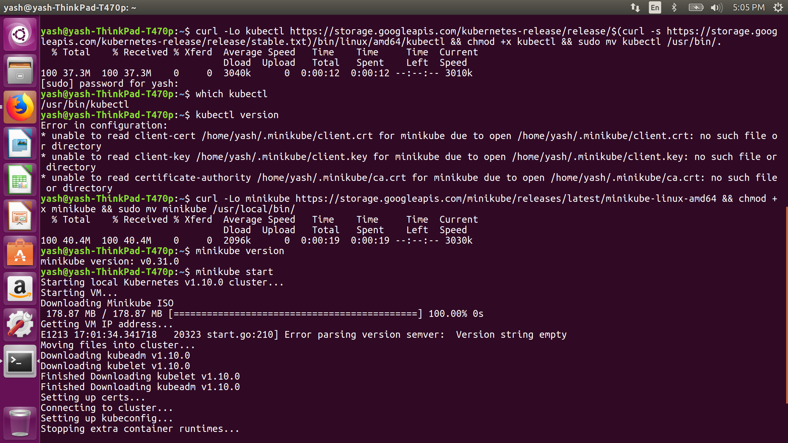
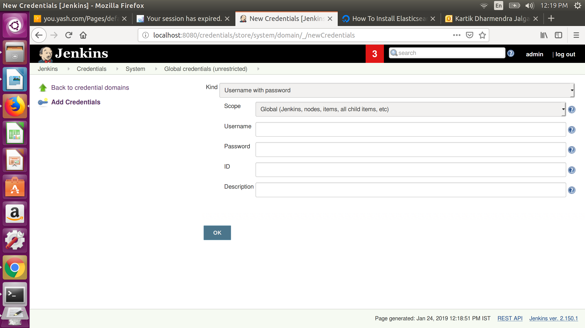
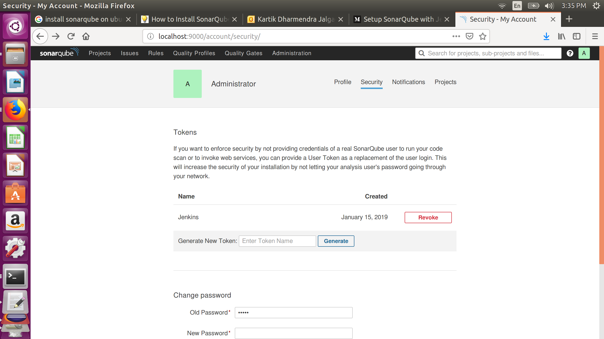
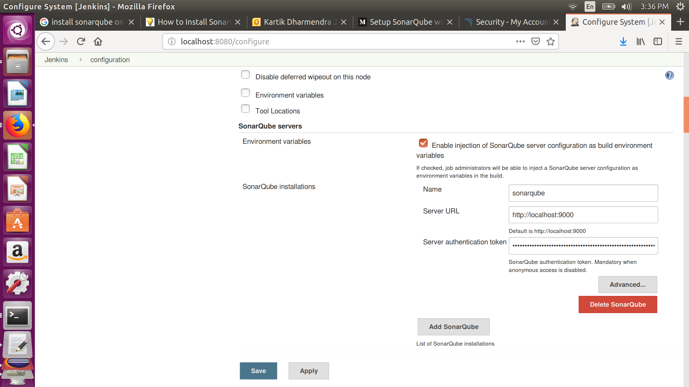
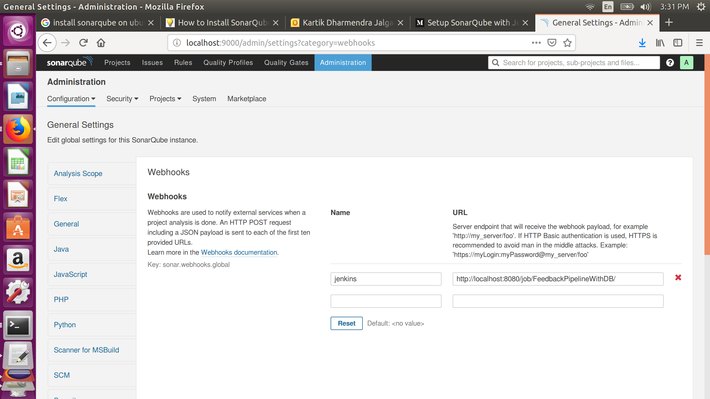
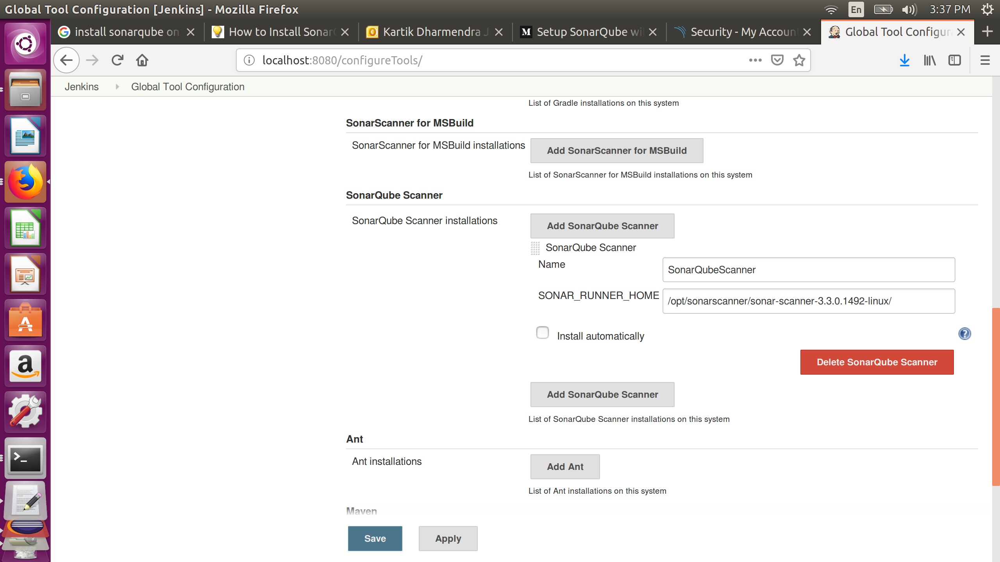

# Capability-Project_With-Documentation
---

# Table of Content
* [Required softwares](#required_softwares)
* [Software Installation](#software_installation)
* [Application setup](#application_setup)
* [Jenkins configuration](#jenkins_configuration)
---

## <a name="required_s oftwares"></a>Required softwares
* [STS](https://spring.io/tools)
* [Jenkins](https://jenkins.io/)
* [GitHub](https://github.com/)
* [Sonarqube](https://www.sonarqube.org/)
* [PostgreSQL](https://www.postgresql.org/)
* [Docker](https://www.docker.com/)
* [Kubernetes](https://kubernetes.io/)
* [Elasticsearch](https://www.elastic.co/products/elasticsearch)
* [Kafka](https://kafka.apache.org/)
* [Logstash](https://www.elastic.co/products/logstash)
* [Kibana](https://www.elastic.co/products/kibana)
---

## <a name="software_installation"></a>Software Installation

<details>
<summary>Jenkins Installation</summary>

 **Step 1 — Installing Jenkins**

* First, we'll add the repository key to the system.
  ```
  $ wget -q -O - https://pkg.jenkins.io/debian/jenkins-ci.org.key | sudo apt-key add -
  ```
* When the key is added, the system will return OK. Next, we'll append the Debian package repository address to the server's sources.list:
  ```
  $ echo deb https://pkg.jenkins.io/debian-stable binary/ | sudo tee /etc/apt/sources.list.d/jenkins.list
  ```
* When both of these are in place, we'll run update so that apt-get will use the new repository:
  ```
  $ sudo apt-get update
  ```
* Finally, we'll install Jenkins and its dependencies, including Java:
  ```
  $ sudo apt-get install jenkins
  ```
 **Step 2 — Starting Jenkins**

* Now that Jenkins and its dependencies are in place, we'll start the Jenkins server.
  ```
  $ sudo systemctl start jenkins
  ```
* Since systemctl doesn't display output, we'll use its status command to verify that it started successfully:
  ```
  $ sudo systemctl status jenkins
  ```
* If everything went well, the beginning of the output should show that the service is active and configured to start at boot:
  ```
  Output
  ● jenkins.service - LSB: Start Jenkins at boot time
  Loaded: loaded (/etc/init.d/jenkins; bad; vendor preset: enabled)
  Active:active (exited) since Thu 2017-04-20 16:51:13 UTC; 2min 7s ago
    Docs: man:systemd-sysv-generator(8)
  ```
* Add jenkins user to the sudo group:
  ```
  $ usermod -a -G sudo jenkins
  ```
 **Step 3 — Opening the Firewall**  
* By default, Jenkins runs on port 8080, so we'll open that port using ufw:
  ```
  $ sudo ufw allow 8080
  ```
* We can see the new rules by checking UFW's status.
  ```
  $ sudo ufw status
  ```
* We should see that traffic is allowed to port 8080 from anywhere:
  ```
  Output
  Status: active

  To                         Action      From
  --                         ------      ----
  OpenSSH                    ALLOW       Anywhere
  8080                       ALLOW       Anywhere
  OpenSSH (v6)               ALLOW       Anywhere (v6)
  8080 (v6)                  ALLOW       Anywhere (v6)
  ```
* Note: If the firewall is inactive, the following commands will make sure that OpenSSH is allowed and then enable it.
  ```
  $ sudo ufw allow OpenSSH
  $ sudo ufw enable
  ```
 **Step 4 — Setting up Jenkins**
* To set up our installation, we'll visit Jenkins on its default port, 8080, using the server domain name or IP address: http://ip_address_or_domain_name:8080

* We should see "Unlock Jenkins" screen, which displays the location of the initial password

* In the terminal window, we'll use the cat command to display the password:
  ```
  $ sudo cat /var/lib/jenkins/secrets/initialAdminPassword
  ```
* We'll copy the 32-character alphanumeric password from the terminal and paste it into the "Administrator password" field, then click "Continue". The next screen presents the option of installing suggested plugins or selecting specific plugins.

* We'll click the "Install suggested plugins" option, which will immediately begin the installation process.

* When the installation is complete, we'll be prompted to set up the first administrative user. It's possible to skip this step and continue as admin using the initial password we used above, but we'll take a moment to create the user.

* Once the first admin user is in place, you should see a "Jenkins is ready!" confirmation screen.

* Click start using jenkins to visit the main Jenkins dashboard.


* At this point, Jenkins has been successfully installed.
</details>

<details>
<summary>Github</summary>

* Create account on github so that you can store your code in online repository.
</details>

<details>
<summary>PostgreSQL Installation</summary>
  
* Before proceeding with installation of any kind of package, use the following command to update your Ubuntu system. To execute this command, remember to login from non-root user with sudo privileges. 
  ```
  $ sudo apt-get update
  ```
* Now install postgresql using this command.
  ```
  $ sudo apt-get install postgresql postgresql-contrib
  ```
  **Using postgresql**
  
* Start the postgresql service by using folowing command:
  ```
  $ sudo service postgresql start
  ```
* locate pg_hba.conf file in your system using command:
  ```
  $ locate pg_hba.conf
  ```
* add following line in _IPV4 local connection_ of pg_hba.conf file so that docker image can be connected to your local databse.
  ```
  host    all   	        all             <ip address of your machine>/32         md5
  ```
* Switch over to the postgres account on your server by typing:
  ```
  $ sudo -i -u postgres
  ```
* You can now access a Postgres prompt immediately by typing:
  ```
  $ psql
  ```
* You will be logged in and able to interact with the database management system right away.
* Command prompt will look like this
  ```
  psql=#
  ```
* To create database and user, use below commands,
  ```
  psql=# create database <databasename>;
  postgres=# create user <username> with encrypted password '<password>';
  postgres=# grant all privileges on database <databasename> to <username>;
  ```
* Exit out of the PostgreSQL prompt by typing:
  ```
  postgres=# \q
  ```
</details>

<details>
<summary>Sonarqube Installation</summary>

* First, create a user for SonarQube with the following command:
  ```
  $ sudo adduser sonar
  ```
* switch to the postgres user with the following command
  ```
  $ sudo su postgres
  ```
* Next, switch to the PostgreSQL shell with the following command:
  ```
  psql
  ```
* Next, set password for sonar user and create a sonar database with the following command:
  ```
  psql=# ALTER USER sonar WITH ENCRYPTED password 'password';
  psql=# CREATE DATABASE sonar OWNER sonar;
  ```
* Next, extit from the PostgreSQL shell:
  ```
  psql=# \q
  ```
* Now exit from postgres user
  ```
  $ exit
  ```
* Next, download the latest version of SonarQube with the following command:
  ```
  $ wget https://binaries.sonarsource.com/Distribution/sonarqube/sonarqube-6.7.6.zip
  ```
* Once the download is completed, unzip the downloaded file with the following command:
  ```
  $ unzip sonarqube-6.7.6.zip
  ```
* Next, copy the extracted directory to the /opt with the following command:
  ```
  $ sudo cp -r sonarqube-6.7.6 /opt/sonarqube
  ```
* add onar user to the group
  ```
  $ sudo groupadd sonar
  $ sudo useradd -c "Sonar System User" -d /opt/sonarqube -g sonar -s /bin/bash sonar
  $ sudo chown -R sonar:sonar /opt/sonarqube
  ```
* Next, you will need to configure SonarQube to run as a sonar user. You can do this with the following command:
  ```
  $ sudo nano /opt/sonarqube/bin/linux-x86-64/sonar.sh
  ```
* Make the following changes:
  ```
  RUN_AS_USER=sonar
  ```
* Save and close the file. Then, open SonarQube default configuration file and modify the database credentials with the one we created earlier:
  ```
  $ sudo nano /opt/sonarqube/conf/sonar.properties
  ```
* Make the following changes:
  ```
  sonar.jdbc.username=sonar
  sonar.jdbc.password=password
  sonar.jdbc.url=jdbc:postgresql://localhost/sonar
  sonar.web.host=127.0.0.1
  sonar.search.javaOpts=-Xms512m  -Xmx512m
  ```
* Save and close the file, when you are finished.
* 
  **Create Systemd Service file for SonarQube**
* Next, you will need to create a systemd service file to manage SonarQube service. You can do this with the following command:
  ```
  $ sudo nano /etc/systemd/system/sonar.service
  ```
* Add the following lines:
  ```
  [Unit]
  Description=SonarQube service
  After=syslog.target network.target

  [Service]
  Type=forking

  ExecStart=/opt/sonarqube/bin/linux-x86-64/sonar.sh start
  ExecStop=/opt/sonarqube/bin/linux-x86-64/sonar.sh stop

  User=sonar
  Group=sonar
  Restart=always

  [Install]
  WantedBy=multi-user.target
  ```
* Save and close the file, when you are finished. Then, start SonarQube service and enable it to start on boot time with the following command:
  ```
  $ sudo systemctl start sonar
  $ sudo systemctl enable sonar
  ```
* You can check the status of SonarQube service with the following command:
  ```
  $ sudo systemctl status sonar
  ```
* output
  ```
  ? sonar.service - SonarQube service
   Loaded: loaded (/etc/systemd/system/sonar.service; disabled; vendor preset: enabled)
   Active: active (running) since Sun 2018-12-02 13:55:34 UTC; 2min 52s ago
  Process: 2339 ExecStart=/opt/sonarqube/bin/linux-x86-64/sonar.sh start (code=exited, status=0/SUCCESS)
   Main PID: 2396 (wrapper)
      Tasks: 133 (limit: 2323)
     CGroup: /system.slice/sonar.service
             ??2396 /opt/sonarqube/bin/linux-x86-64/./wrapper /opt/sonarqube/bin/linux-x86-64/../../conf/wrapper.conf wrapper.syslog.ident=SonarQ
             ??2399 java -Dsonar.wrapped=true -Djava.awt.headless=true -Xms8m -Xmx32m -Djava.library.path=./lib -classpath ../../lib/jsw/wrapper-
             ??2445 /usr/lib/jvm/java-8-oracle/jre/bin/java -XX:+UseConcMarkSweepGC -XX:CMSInitiatingOccupancyFraction=75 -XX:+UseCMSInitiatingOc
             ??2545 /usr/lib/jvm/java-8-oracle/jre/bin/java -Djava.awt.headless=true -Dfile.encoding=UTF-8 -Djava.io.tmpdir=/opt/sonarqube/temp -
             ??2622 /usr/lib/jvm/java-8-oracle/jre/bin/java -Djava.awt.headless=true -Dfile.encoding=UTF-8 -Djava.io.tmpdir=/opt/sonarqube/temp -

  Dec 02 13:55:33 ubuntu1804 systemd[1]: Starting SonarQube service...
  Dec 02 13:55:33 ubuntu1804 sonar.sh[2339]: Starting SonarQube...
  Dec 02 13:55:34 ubuntu1804 sonar.sh[2339]: Started SonarQube.
  Dec 02 13:55:34 ubuntu1804 systemd[1]: Started SonarQube service.
  ```
</details>

<details>
<summary>Sonar Scanner Installation</summary>
  
* create a directory
  ```
  $ sudo mkdir /opt/sonarscanner
  $ cd /opt/sonarscanner
  ```
* download sonar scanner:
  ```
  $ https://docs.sonarqube.org/display/SCAN/Analyzing+with+SonarQube+Scanner
  ```
* Extract the zip file
  ```
  $ sudo unzip sonar-scanner-cli-3.0.3.778-linux.zip
  ```
* remove downloaded zip file
  ```
  $ sudo rm sonar-scanner-cli-3.0.3.778-linux.zip
  ```
* open sonar-scanner.properties file
  ```
  $ sudo nano sonar-scanner-3.0.3.778-linux/conf/sonar-scanner.properties
  ```
* add below line in property file
  ```
  sonar.host.url=https://localhost:9000
  ```
* change permission of scanner
  ```
  $ sudo chmod +x sonar-scanner-3.0.3.778-linux/bin/sonar-scanner
  ```
</details>

<details>
<summary>Docker istallation</summary>
  
* First, in order to ensure the downloads are valid, add the GPG key for the official Docker repository to your system:
  ```
  $ curl -fsSL https://download.docker.com/linux/ubuntu/gpg | sudo apt-key add -
  ```
* Add the Docker repository to APT sources:
  ```
  $ sudo add-apt-repository "deb [arch=amd64] https://download.docker.com/linux/ubuntu $(lsb_release -cs) stable"
  ```
* Next, update the package database with the Docker packages from the newly added repo:
  ```
  $ sudo apt-get update
  ```
* Make sure you are about to install from the Docker repo instead of the default Ubuntu 16.04 repo:
  ```
  $ apt-cache policy docker-ce
  ```
* You should see output similar to the follow:
  ```
  docker-ce:
  Installed: (none)
  Candidate: 18.06.1~ce~3-0~ubuntu
  Version table:
     18.06.1~ce~3-0~ubuntu 500
        500 https://download.docker.com/linux/ubuntu xenial/stable amd64 Packages
  ```
* Notice that docker-ce is not installed, but the candidate for installation is from the Docker repository for Ubuntu 16.04 (xenial).
* 
* Finally, install Docker:
  ```
  $ sudo apt-get install -y docker-ce
  ```
* Docker should now be installed, the daemon started, and the process enabled to start on boot. Check that it's running:
  ```
  $ sudo systemctl status docker
  ```
* The output should be similar to the following, showing that the service is active and running:
  ```
  Output
  ● docker.service - Docker Application Container Engine
     Loaded: loaded (/lib/systemd/system/docker.service; enabled; vendor preset: enabled)
     Active: active (running) since Thu 2018-10-18 20:28:23 UTC; 35s ago
       Docs: https://docs.docker.com
   Main PID: 13412 (dockerd)
     CGroup: /system.slice/docker.service
             ├─13412 /usr/bin/dockerd -H fd://
             └─13421 docker-containerd --config /var/run/docker/containerd/containerd.toml
  ```
</details>

<details>
  <summary>Kubernetes Installation</summary>
  
 **1. Update Ubuntu dependencies**
* Update your system’s dependencies to get ready for the Kubernetes installation.
  ```
  $ sudo apt-get update
  $ sudo apt-get install -y apt-transport-https
  ```
  **2. Install VirtualBox on Ubuntu**
* Install VirtualBox to run virtual machines on your system.
  ```
  $ sudo apt-get install -y virtualbox virtualbox-ext-pack
  ```
  **3. Install kubectl**
* Install kubectl, which you use to interact with the Kubernetes cluster.
  ```
  $ curl -s https://packages.cloud.google.com/apt/doc/apt-key.gpg | sudo apt-key add -
  $ sudo touch /etc/apt/sources.list.d/kubernetes.list 
  $ echo "deb http://apt.kubernetes.io/ kubernetes-xenial main" | sudo tee -a /etc/apt/sources.list.d/kubernetes.list
  $ sudo apt-get update
  $ sudo apt-get install -y kubectl
  ```
  **4. Install minikube**
* Download and install minikube, which runs a single node Kubernetes cluster on your machine.
  ```
  $ sudo curl -Lo minikube https://storage.googleapis.com/minikube/releases/v0.28.2/minikube-linux-amd64
  $ sudo chmod +x minikube && sudo mv minikube /usr/local/bin/
  ```
* Now start up Minikube and use kubectl to find what version of Kubernetes you’re running on Ubuntu.
  ```
  $ minikube start
  ```
* Terminal will look like this

</details>

<details>
<summary>Zookeeper Installation</summary>

* Install zookeper using command
  ```
  $ sudo apt-get install zookeeperd
  ```
* we will now check if Zookeeper is alive and if it’s OK 😛
  ```
  $ telnet localhost 2181
  ```
* at Telnet prompt, we will enter
  ```
  ruok
  ```
* (are you okay) if it’s all okay it will end telnet session and reply with
  ```
  imok
  ```
* Start zookeeper service using 
  ```
  $ sudo /usr/share/zookeeper/bin/zkServer.sh start-foreground
  ```
* 
</details>

<details>
  <summary>Kafka Installation</summary>
  
* Download kafka
  ```
  $ wget wget http://mirrors.estointernet.in/apache/kafka/2.1.0/kafka_2.11-2.1.0.tgz
  ```
* Next, create a directory for Kafka installation:
  ```
  $ sudo mkdir /opt/Kafka
  $ cd /opt/Kafka
  ```
* Extract the downloaded archive using tar command in /opt/Kafka:
  ```
  sudo tar -xvf kafka_2.11-2.1.0.tgz -C /opt/Kafka/
  ```
* open server.properties using following command
  ```
  sudo nano /opt/Kafka/kafka_2.11-2.1.0/config/server.properties
  ```
* add following line to the file
  ```
  listeners=PLAINTEXT://<io address of your machine>:9092
  ```
* The next step is to start Kafka server, you can start it by running kafka-server-start.sh script located at /opt/Kafka/kafka_2.11-2.1.0/bin/ directory.
  ```
  $ sudo /opt/Kafka/kafka_2.11-2.1.0/bin/kafka-server-start.sh /opt/Kafka/kafka_2.11-2.1.0/config/server.properties
  ```
  **Testing installation**

* In a terminal start a kafka server
  ```
  sudo /opt/Kafka/kafka_2.11-2.1.0/bin/kafka-server-start.sh /opt/Kafka/kafka_2.11-2.1.0/config/server.properties
  ```
* In another terminal create a topic
  ```
  $ sudo /opt/Kafka/kafka_2.11-2.1.0/bin/kafka-topics.sh --create --zookeeper localhost:2181 --replication-factor 1 --partitions 1 --topic test
  ```
* List all topics with the command below and it will print test the topic we just created
  ```
  $ /opt/Kafka/kafka_2.11-2.1.0/bin/kafka-topics.sh --list --zookeeper localhost:2181
  ```
* Let’s start publishing messages on test topic
  ```
  $ /opt/Kafka/kafka_2.11-2.1.0/bin/kafka-console-producer.sh --broker-list localhost:9092 --topic test
  ```
* We will now create a subscriber on test topic in another terminal and listen from the beginning of the topic.
  ```
  $ /opt/Kafka/kafka_2.11-2.1.0/bin/kafka-console-consumer.sh --bootstrap-server localhost:9092 --topic test --from-beginning
  ```
* Enter some message in the producer
  ```
  $ Hello world!!!
  ```
* You will see the messages appearing on the subscriber terminal.
</details>

<details>
  <summary>Elasticsearch Installation</summary>
  
* To begin, run the following command to import the Elasticsearch public GPG key into APT:
  ```
  $ wget -qO - https://artifacts.elastic.co/GPG-KEY-elasticsearch | sudo apt-key add -
  ```
* Next, add the Elastic source list to the sources.list.d directory, where APT will look for new sources:
  ```
  $ echo "deb https://artifacts.elastic.co/packages/6.x/apt stable main" | sudo tee -a /etc/apt/sources.list.d/elastic-6.x.list
  ```
* Next, update your package lists so APT will read the new Elastic source:
  ```
  $ sudo apt update
  ```
* Then install Elasticsearch with this command:
  ```
  $ sudo apt install elasticsearch
  ```
* Once Elasticsearch is finished installing, use your preferred text editor to edit Elasticsearch's main configuration file, elasticsearch.yml. Here, we'll use nano:
  ```
  $ sudo nano /etc/elasticsearch/elasticsearch.yml
  ```
* Elasticsearch listens for traffic from everywhere on port 9200. You will want to restrict outside access to your Elasticsearch instance to prevent outsiders from reading your data or shutting down your Elasticsearch cluster through the REST API. Find the line that specifies network.host, uncomment it, and replace its value with localhost so it looks like this:
  ```
  ...
  network.host: localhost
  ...
  ```
* Save and close elasticsearch.yml by pressing CTRL+X, followed by Y and then ENTER if you're using nano. Then, start the Elasticsearch service with systemctl:
  ```
  $ sudo systemctl start elasticsearch
  ```
* Next, run the following command to enable Elasticsearch to start up every time your server boots:
  ```
  $ sudo systemctl enable elasticsearch
  ```
* You can test whether your Elasticsearch service is running by sending an HTTP request:
  ```
  $ curl -X GET "localhost:9200"
  ```
* You will see a response showing some basic information about your local node, similar to this:
  ```
  Output
  {
    "name" : "ZlJ0k2h",
    "cluster_name" : "elasticsearch",
    "cluster_uuid" : "beJf9oPSTbecP7_i8pRVCw",
    "version" : {
      "number" : "6.4.2",
      "build_flavor" : "default",
      "build_type" : "deb",
      "build_hash" : "04711c2",
      "build_date" : "2018-09-26T13:34:09.098244Z",
      "build_snapshot" : false,
      "lucene_version" : "7.4.0",
      "minimum_wire_compatibility_version" : "5.6.0",
      "minimum_index_compatibility_version" : "5.0.0"
    },
    "tagline" : "You Know, for Search"
  }
  ```
</details>

<details>
  <summary>Kibana installation</summary>
  
* use below command to install kibana
  ```
  $ sudo apt install kibana
  ```
* Then enable and start the Kibana service:
  ```
  $ sudo systemctl enable kibana
  $ sudo systemctl start kibana
  ```
* By default, Kibana listens on localhost which means you can not access Kibana web interface from external machines.
* To enale the access, edit /etc/kibana/kibana.yml file.
  ```
  $ sudo nano /etc/kibana/kibana.yml
  ```
* Make changes to the below line with your server IP address.
  ```
  server.host: <ip address of your machine>
  ```
* Also, some cases Elasticsearch and Kibana run on different machines, so update the below line with IP address of Elasticsearch server.
  ```
  elasticsearch.url: "http://localhost:9200"
  ```
* Start and enable Kibana on machine startup.
  ```
  $ sudo systemctl restart kibana
  $ sudo systemctl enable kibana
  ```
</details>

<details>
  <summary>Logstash Installation</summary>
  
* Install Logstash with this command:
  ```
  $ sudo apt install logstash
  ```
* After installing Logstash, you can move on to configuring it. Logstash's configuration files are written in the JSON format and reside in the /etc/logstash/conf.d directory. As you configure it, it's helpful to think of Logstash as a pipeline which takes in data at one end, processes it in one way or another, and sends it out to its destination (in this case, the destination being Elasticsearch). A Logstash pipeline has two required elements, input and output, and one optional element, filter. The input plugins consume data from a source, the filter plugins process the data, and the output plugins write the data to a destination.

* Create a configuration file called **logstash-kafka.conf**
  ```
  input {
    kafka {
            bootstrap_servers => "<ip address mentioned in kafka>:9092"
            topics => ["feedback-api"]
    }
  }

  output {
     elasticsearch {
        hosts => ["localhost:9200"]
        index => "feedback-api"
        workers => 1
      }
  }
  ```
* Save and close the file.
* Test your Logstash configuration with this command:
  ```
  $ sudo -u logstash /usr/share/logstash/bin/logstash --path.settings /etc/logstash -t
  ```
* If there are no syntax errors, your output will display Configruation OK after a few seconds. If you don't see this in your output, check for any errors that appear in your output and update your configuration to correct them.
* If your configuration test is successful, start and enable Logstash to put the configuration changes into effect:
  ```
  $ sudo systemctl start logstash
  $ sudo systemctl enable logstash
  ```
</details>

---
## <a name="application_setup"></a>Application setup
Create a spring boot application.
We need to add following files in the root directory of application.
  
  <details>
  <summary>Dockerfile</summary>

  * Docker can build images automatically by reading the instructions from a Dockerfile. A Dockerfile is a text document that contains all the commands a user could call on the command line to assemble an image. A Dockerfile must start with a `FROM` instruction. The FROM instruction specifies the Base Image from which you are building. 
  * The VOLUME instruction creates a mount point with the specified name and marks it as holding externally mounted volumes from native host or other containers. 
  * The ADD instruction copies new files, directories or remote file URLs from <src> and adds them to the filesystem of the image at the path <dest>.
  * The EXPOSE instruction informs Docker that the container listens on the specified network ports at runtime.
  * An ENTRYPOINT allows you to configure a container that will run as an executable.
  * Sample: [Dockerfile](https://github.com/kartikjalgaonkar/Capability-project/blob/master/Dockerfile)
</details>
  
<details>
  <summary>Jenkinsfile</summary>
  
  * Jenkins Pipeline is a suite of Jenkins features, installed as plugins, which enable implementation of continuous delivery pipelines, which are the automated processes for getting software from source control through deployment to end users.
  * A Jenkinsfile is a text file that contains the definition of a Jenkins Pipeline and is checked into source control.
  * We will be designing Jenkisfile using groovy script.
  * It contains various stages of CI/CD (from pulling code to its deployment).
  * Sample: [Jenkinsfile](https://github.com/kartikjalgaonkar/Capability-project/blob/master/Jenkinsfile)
</details>
  
<details>
  <summary>deployment.yml</summary>
  
  * This file contains all the information related to deployment like name of deploymnet, number of replicas to be created, which image to be used for deployment, etc.
  * Sample: [deployment.yml](https://github.com/kartikjalgaonkar/Capability-project/blob/master/deployment.yml)
</details>
  
<details>
  <summary>service.yml</summary>
  
  * A Kubernetes Service is an abstraction which defines a logical set of Pods and a policy by which to access them - sometimes called a micro-service. The set of Pods targeted by a Service is (usually) determined by a Label Selector.
  * Sample: [service.yml](https://github.com/kartikjalgaonkar/Capability-project/blob/master/service.yml)
</details>
  
<details>
  <summary>ingress.yml</summary>

  * Ingress, added in Kubernetes v1.1, exposes HTTP and HTTPS routes from outside the cluster to services within the cluster. Traffic routing is controlled by rules defined on the ingress resource.
  * An ingress can be configured to give services externally-reachable URLs, load balance traffic, terminate SSL, and offer name based virtual hosting. An ingress controller is responsible for fulfilling the ingress, usually with a loadbalancer, though it may also configure your edge router or additional frontends to help handle the traffic.
  * An ingress does not expose arbitrary ports or protocols. Exposing services other than HTTP and HTTPS to the internet typically uses a service of type Service.Type=NodePort or Service.Type=LoadBalancer.
  * Sample: [ingress.yml](https://github.com/kartikjalgaonkar/Capability-project/blob/master/ingress.yml)
</details>
  
<details>
  <summary>hpa.yml</summary>
  
  * hpa stands for Horizontal Pod Autoscaler. It automatically scales the number of pods in a replication controller, deployment or replica set based on observed CPU utilization.
  * Before applying hpa.yml file make sure that _heapster_ and _metrics-server_ are enabled on your system.
  * To check, use **minikube addons**
  * To enable addon, use **minikube addons enable addon-name**
  * Sample: [hpa.yml](https://github.com/kartikjalgaonkar/Capability-project/blob/master/hc-feedback-hpa.yaml)
</details>
  
<details>
  <summary>sonar-project.properties</summary>

  * To generate sonar report, we need sonar-project.properties file.
  * Sample: [sonar-project.properties](https://github.com/kartikjalgaonkar/Capability-project/blob/master/sonar-project.properties)
</details>

## <a name="jenkins_configuration"></a>Jenkins Configuration
```diff
- Pre-requisite before configuring jenkins to create a pipeline:
+ Create a github account to create a repository of your code.
+ Create a docker account to store docker image of your application.
```
<details>
  <summary>Jenkins plugins</summary>
  
Add following plugins to jenkins
  * Docker plugin
  * GitHub Integration Plugin
  * Kafka Logs Plugin
  * Kubernetes Continuous Deploy Plugin
  * Pipeline: GitHub Groovy Libraries
  * SonarQube Scanner for Jenkins
</details>

<details>
  <summary>Adding github and docker credentials to jenkins</summary>
  
* Start jenkins
* go to credentials --> System --> Global credentials(unrestricted) --> add credentials.

* add docker, git and sonar credentials in this tab. Give unique id because it will be used in jenkins pipeline.
</details>

<details>
  <summary>Sonar configuration with jenkins</summary>

  * go to sonar url --> click on My account(http://localhost:9000/account/security/) --> Generate Token
  
  
  
  * go to jenkins --> Manage jenkins --> Configure jenkins --> SonarQube servers --> Enable Environment variables and add sonar details --> add Server authentication token generated in above step.
  
  
  
  * go to sonar --> administration --> webhooks --> add jenkins pipeline url
  
  
  
  * go to jenkins --> manage jenkins --> Global Tool Configuration --> SonarQube Scanner 
  * add path of sonar scanner in SONAR_RUNNER_HOME
  
  
  
  * You are done with sonar configuration in Jenkins!!
</details>
